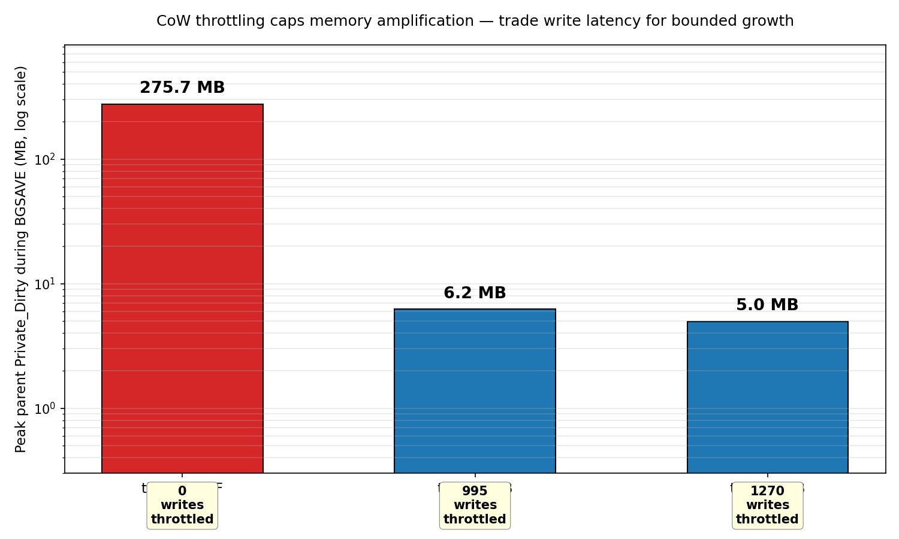
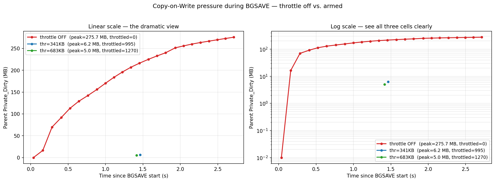
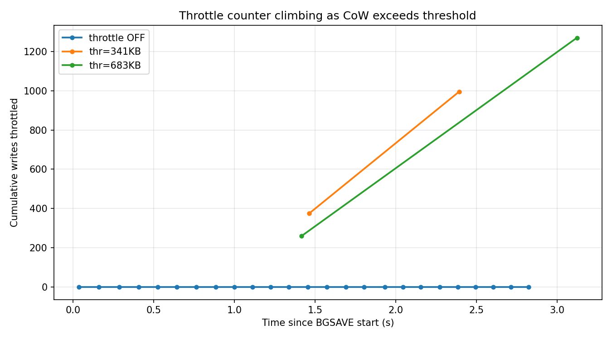

# Experiment 1 — CoW Write Throttling

**Type:** Major modification (modifies Redis C source)
**Status:** ✅ Validated end-to-end

---

## What problem are we solving

When Redis runs `BGSAVE` under heavy write traffic, the parent process's
resident memory can grow rapidly. Here's why:

1. `BGSAVE` calls `fork()`. Linux gives the child a copy of the parent's
   memory — but lazily, sharing pages until either side modifies them.
2. Every write the parent does after the fork triggers Linux's
   **copy-on-write (CoW)**: the kernel duplicates that 4 KB page so the
   child still sees the pre-fork version.
3. Under a write storm during BGSAVE, hundreds of MB of pages get duplicated.
   The parent's RSS can roughly double. On a tight host, this triggers OOM.

Stock Redis reports CoW pressure in `INFO persistence` but does nothing
about it. Operators are told to "provision 2× RAM and hope."

## What we built

When CoW pressure exceeds a configurable threshold during BGSAVE,
**slow down write commands** by a configurable microsecond delay.
Reads stay fast. Memory growth becomes bounded.

This is an **explicit tradeoff**:

> Sacrifice some write latency during BGSAVE → bound memory amplification.

---

## What we changed (in `redis-modified/src/`)

| File | Change |
|---|---|
| `server.h` | Added 4 fields to `struct redisServer` (threshold, delay, observed bytes, throttled count) |
| `server.c` | New helper `cowSampleSmapsRollup()` that reads `Private_Dirty` from `/proc/self/smaps_rollup` |
| `server.c` | Hook in `serverCron()` — samples CoW every 100 ms while BGSAVE is active |
| `server.c` | Throttle check in `processCommand()` — if write + CoW > threshold, `usleep()` and increment counter |
| `server.c` | New `INFO persistence` fields exposing live state |
| `config.c` | Two new config knobs: `bgsave-cow-throttle-bytes`, `bgsave-cow-throttle-delay-us` |
| `rdb.c` | Reset observed CoW to 0 in `backgroundSaveDoneHandlerDisk()` when BGSAVE ends |

**Total: ~50 lines of C across 4 files.** The full patch is in
[`patches/cow_throttle.patch`](patches/cow_throttle.patch).

---

## How to run

```bash
cd bench

# Smoke run: 3 cells, ~1 minute
python3 run_matrix.py --tradeoff-demo

# Generate plots and summary
python3 make_plots.py

# View results
cat ../results/summary.csv
ls ../plots/                  # 3 PNGs
ls ../logs/                   # one redis-server.log per cell
```

---

## Headline result

The benchmark sweeps three throttle settings against a continuous write
storm during BGSAVE. Same workload, same hardware — only the throttle
threshold differs.

| Setting | BGSAVE wall (s) | Peak parent CoW | Writes throttled |
|---|---:|---:|---:|
| `throttle OFF` (stock-equivalent) | 2.83 | **275.7 MB** | 0 |
| `thr=341KB` | 2.40 | 6.2 MB | 995 |
| `thr=683KB` | 3.12 | 5.0 MB | 1,270 |

**Memory amplification dropped from 275 MB to ~5 MB** when the throttle was
armed — a **44–55× reduction**. The price: ~1,000–1,300 writes paid an
extra 200 µs each during the BGSAVE window. Reads were not affected.

### Plots







---

## How the throttle decides

```c
// In processCommand(), just before call(c, CMD_CALL_FULL):
if (server.child_type == CHILD_TYPE_RDB
    && server.bgsave_cow_throttle_bytes > 0
    && is_write_command
    && server.stat_bgsave_cow_observed_bytes > server.bgsave_cow_throttle_bytes)
{
    usleep(server.bgsave_cow_throttle_delay_us);
    server.stat_bgsave_writes_throttled++;
}
```

That's the entire throttle. Five lines.

---

## Tradeoffs you are paying for

Honest list of costs:

1. **Write latency rises during BGSAVE.** Every throttled write sleeps
   200 µs (default). Reads are untouched.
2. **`usleep()` blocks the event loop.** While one write is sleeping, all
   other clients are stalled on that thread. A production version would
   yield to the event loop instead.
3. **Polling overshoots the threshold by ~100 ms.** Between cron ticks, CoW
   can grow past the configured limit before the throttle engages.
4. **Linux-only.** `/proc/self/smaps_rollup` doesn't exist on macOS or BSD.
5. **Doesn't prevent OOM if the dataset itself doesn't fit in RAM.** It
   bounds *growth* during BGSAVE, not absolute memory use.

---

## Folder contents

```
exp1-cow-throttling/
├── README.md           ← this file
├── patches/
│   └── cow_throttle.patch
├── bench/
│   ├── run_matrix.py   ← matrix runner
│   └── make_plots.py   ← aggregate + plot
├── results/
│   ├── raw.jsonl       ← one line per cell
│   └── summary.csv     ← aggregated table
├── plots/
│   ├── headline_bar.png
│   ├── cow_vs_time.png
│   └── throttle_vs_time.png
└── logs/
    └── redis-cow-thr*.log  ← per-cell Redis server log
```
