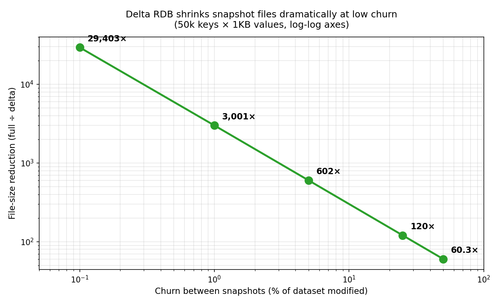
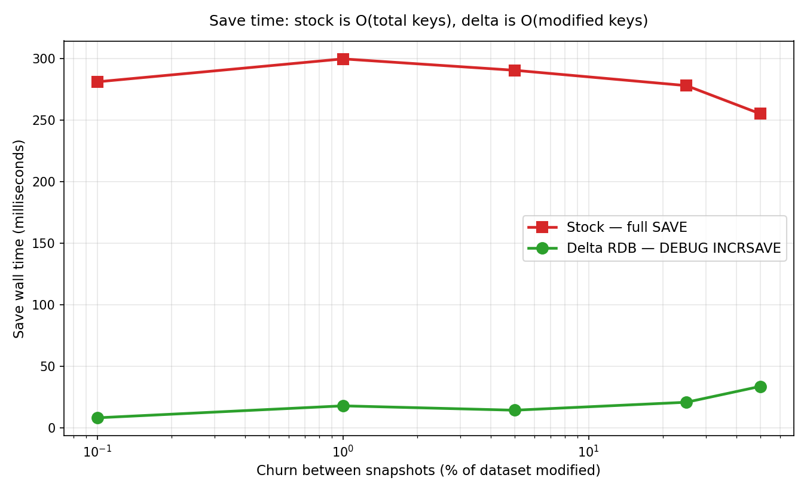
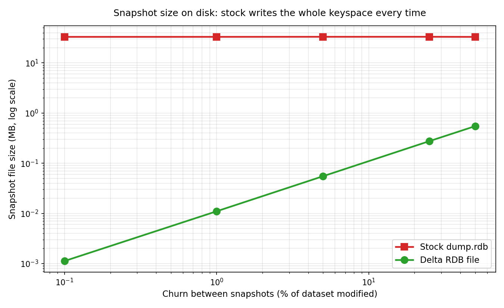

# Experiment 2 — Delta RDB

**Type:** Major modification (modifies Redis C source)
**Status:** ✅ Validated end-to-end

---

## What problem are we solving

Every time you run `BGSAVE`, stock Redis serializes the **entire** keyspace
to disk. It walks every single key in the hash table and writes it to a
fresh `dump.rdb` file, regardless of how many keys actually changed.

This means:

- If you have 5 million keys and only 10 changed since the last snapshot,
  Redis still writes all 5 million.
- Disk I/O cost is **O(total keys)**, not O(changed keys).
- For high-snapshot-frequency workloads with low churn, you're wasting
  enormous amounts of I/O.

There's no built-in mechanism to write only "what changed."

## What we built

**Delta RDB**: maintain a per-database **`dirty_keys`** set and a
**`deleted_keys`** set. Every time a key is modified, it joins `dirty_keys`.
Every time a key is deleted, it joins `deleted_keys`.

When triggered, a new `DEBUG INCRSAVE` command walks only those two sets
and writes a delta snapshot containing **only the modified keys and
deletion tombstones**.

The result is a delta file thousands of times smaller than the full snapshot
when churn is low.

---

## What we changed (in `redis-modified/src/`)

| File | Change |
|---|---|
| `server.h` | Added `dirty_keys` and `deleted_keys` (both `dict*`) to `struct redisDb`. Declared `exp6SignalDeletedKey()`. |
| `db.c` | Hook in `signalModifiedKey()` adds the key to `dirty_keys`. New `exp6SignalDeletedKey()` adds tombstones to `deleted_keys`. |
| `lazyfree.c` | Hook in `dbAsyncDelete()` so async deletes also record tombstones. |
| `server.c` | Allocate `dirty_keys` and `deleted_keys` dicts on server boot. |
| `rdb.h` | New opcodes: `RDB_OPCODE_INCR_HEADER` (0xE0), `RDB_OPCODE_INCR_DELETE` (0xE1). |
| `rdb.c` | New function `rdbSaveIncremental()` — walks `dirty_keys`, emits live key-value pairs from `db->dict`, then walks `deleted_keys` and emits tombstones. Clears both sets on successful save. |
| `debug.c` | Two new debug commands: `DEBUG INCRSAVE <filename>` triggers an incremental save; `DEBUG INCRSTATS` reports current dirty/deleted counts. |

**Total: ~240 lines across 7 files.** All patches live in
[`patches/`](patches/). See [`patches/GAP_FIXES.md`](patches/GAP_FIXES.md)
for the explicitly-deferred items (replication safety, automatic full vs
delta decision, etc.).

---

## How to run

### Quick proof (~30 seconds):

```bash
cd bench
./manual_test.sh
```

This script: loads 50,000 keys, takes a full snapshot, restarts to clear
state, applies 1% churn (500 SETs + 50 DELs), then triggers an incremental
save and prints the size ratio.

Expected output:

```
====================================================
    HEADLINE COMPARISON
====================================================
  Full snapshot (50000 keys):              ~33 MB
  Delta snapshot (~500 dirty + 50 del):    ~14 KB
  Reduction:                               ~2294× smaller
====================================================
```

### Full churn sweep (~5 minutes):

```bash
python3 run_churn_matrix.py --reps 2 --n-keys 50000
python3 make_plots.py
cat ../results/summary.csv
ls ../plots/    # 3 PNGs
```

---

## Headline result

The full benchmark sweeps churn between snapshots from 0.1% to 50%:

| Churn % | Stock snapshot | Delta snapshot | Reduction | Save time (stock) | Save time (delta) |
|---:|---:|---:|---:|---:|---:|
| 0.10% | 33.0 MB | 1.1 KB | **29,403×** | 281 ms | 8 ms |
| 1.00% | 33.0 MB | 10.7 KB | 3,001× | 300 ms | 18 ms |
| 5.00% | 33.1 MB | 53.7 KB | 602× | 290 ms | 14 ms |
| 25.00% | 33.1 MB | 268.4 KB | 120× | 278 ms | 21 ms |
| 50.00% | 33.0 MB | 533.9 KB | 60× | 256 ms | 34 ms |

Even at 50% churn — half the dataset modified — delta files are still 60×
smaller than full snapshots. Delta save time scales with **actual churn**,
while full save time stays flat (it always touches every key).

### Plots







---

## How the save path decides what to write

```c
// In rdbSaveIncremental(), instead of iterating the full keyspace:
for (j = 0; j < server.dbnum; j++) {
    redisDb *db = server.db + j;
    if (dictSize(db->dirty_keys) == 0 && dictSize(db->deleted_keys) == 0)
        continue;

    // Emit live values for dirty keys
    dictIterator *di = dictGetSafeIterator(db->dirty_keys);
    while ((de = dictNext(di)) != NULL) {
        sds keystr = dictGetKey(de);
        dictEntry *live = dictFind(db->dict, keystr);
        if (!live) continue;
        rdbSaveKeyValuePair(&rdb, &key, dictGetVal(live), expire);
    }

    // Emit tombstones for deleted keys
    di = dictGetSafeIterator(db->deleted_keys);
    while ((de = dictNext(di)) != NULL) {
        rdbSaveType(&rdb, RDB_OPCODE_INCR_DELETE);
        rdbSaveRawString(&rdb, dictGetKey(de), ...);
    }
}
```

When `rdbSaveIncremental()` completes successfully, both shadow sets are
cleared — the next incremental save starts from a clean slate.

---

## Tradeoffs you are paying for

1. **In-memory bookkeeping.** Each modified key adds an entry to
   `dirty_keys` (≈ 30 bytes per key). On a hot workload this is a few
   extra hash-table ops per write.
2. **Delta files are not directly loadable by `redis-server`.** They are
   measurement artifacts. Reconstructing state requires the base RDB plus
   the delta. We deliberately did not implement a delta-aware loader; that's
   a much bigger change.
3. **Replication breaks if a replica syncs while in delta mode.** PSYNC
   full-resync needs a complete RDB. A production version would force a
   full save for replication payloads.
4. **High-churn workloads lose the win.** At 50% churn the delta is still
   60× smaller, but it's no longer "thousands of times" smaller. Past some
   threshold the bookkeeping overhead exceeds the I/O savings.
5. **FLUSHDB doesn't clear `dirty_keys` properly in this patch.** Documented
   in [`patches/GAP_FIXES.md`](patches/GAP_FIXES.md) but not implemented —
   for production, FLUSHDB should trigger a forced full save.

---

## Folder contents

```
exp2-delta-rdb/
├── README.md                ← this file
├── patches/
│   ├── exp6_db.c.diff       ← signalModifiedKey + tombstone hooks
│   ├── exp6_debug.c.diff    ← DEBUG INCRSAVE / DEBUG INCRSTATS
│   ├── exp6_lazyfree.c.diff ← async-delete hook
│   ├── exp6_rdb.c.diff      ← rdbSaveIncremental() implementation
│   ├── exp6_rdb.h.diff      ← new opcodes
│   ├── exp6_server.c.diff   ← dict allocation on boot
│   ├── exp6_server.h.diff   ← struct redisDb additions
│   └── GAP_FIXES.md         ← deferred items (replication, FLUSHDB, etc.)
├── bench/
│   ├── manual_test.sh       ← single-shot proof
│   ├── run_churn_matrix.py  ← churn sweep
│   └── make_plots.py        ← aggregate + plot
├── results/
│   ├── churn_matrix.jsonl   ← raw per-cell data
│   └── summary.csv          ← aggregated table
├── plots/
│   ├── size_ratio_vs_churn.png
│   ├── save_time_vs_churn.png
│   └── file_size_compare.png
└── logs/                    ← sampled redis-server logs from real runs
```
