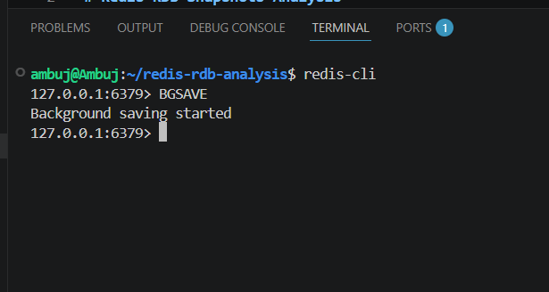
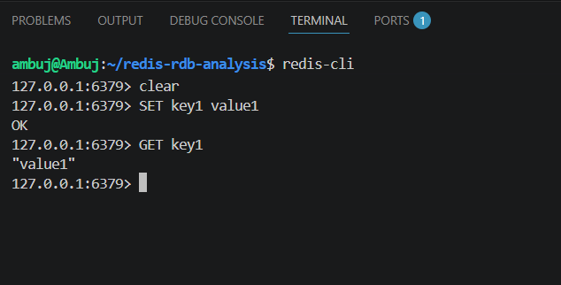
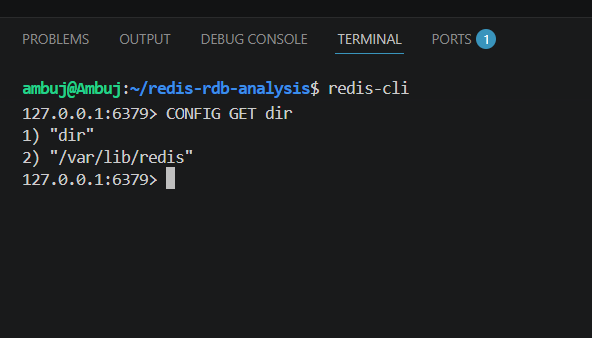
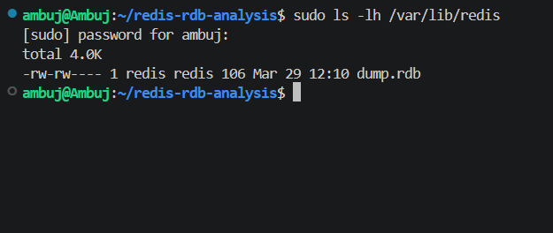
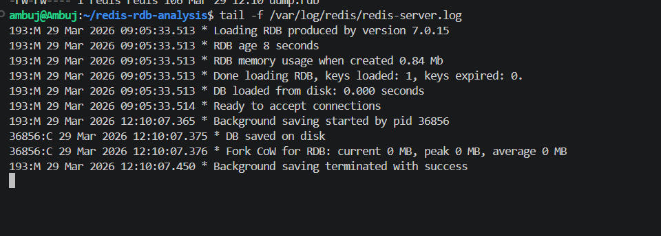

# Redis RDB Snapshots Analysis

## 1. Problem Statement

Redis is an in-memory database designed for high performance. Since all data is stored in memory, there is a risk of data loss in case of a crash or system failure. The system therefore needs a way to persist data to disk without affecting performance.

RDB snapshots solve this problem by periodically saving the entire dataset to disk as a point-in-time snapshot. The key requirement is that this process should not block normal read and write operations.

---

## 2. Execution Trace

The execution path was traced starting from the user command `BGSAVE` issued through the Redis CLI.

When `BGSAVE` is executed, Redis calls the function `bgsaveCommand()` located in `src/server.c`. This function first checks whether a background save operation is already in progress or if any other child process is running.

If no conflicting operation is found, the function calls `rdbSaveBackground()` defined in `src/rdb.c`.

Inside `rdbSaveBackground()`, Redis creates a child process using the `fork()` system call. The child process is responsible for writing the snapshot to disk, while the parent process continues to handle client requests.

The child process executes `rdbSave()`, which iterates over all keys in memory and writes them into a binary file called `dump.rdb`.

Overall execution flow:

BGSAVE → bgsaveCommand() → rdbSaveBackground() → fork() → rdbSave() → dump.rdb

---

## 3. Design Decisions

### 3.1 Fork-based Snapshotting

Implementation: `rdbSaveBackground()` in `rdb.c`

Redis uses the `fork()` system call to create a child process for snapshot creation. This allows the main process to continue serving requests without blocking.

Tradeoff: This approach increases memory usage due to copy-on-write behavior. If the dataset is large and many writes occur during snapshotting, memory overhead can become significant.

---

### 3.2 Single Background Process Constraint

Implementation: checks using `hasActiveChildProcess()` and `server.child_type`

Redis allows only one background operation (either RDB save or AOF rewrite) at a time.

Tradeoff: This avoids resource contention but can delay persistence operations if another background process is already running.

---

### 3.3 Snapshot-based Persistence

Implementation: configuration parameter `save` in Redis configuration

Redis uses periodic snapshots instead of continuous logging.

Tradeoff: Data may be lost between snapshots if a crash occurs before the next snapshot is taken.

---

## 4. Concept Mapping

* Storage: Redis uses snapshot-based persistence instead of B-tree or LSM tree structures. Data is stored in memory and periodically written to disk.
* Execution: The system uses a single-threaded event loop combined with background processing via `fork()`.
* Fault Tolerance: Recovery is performed by loading the `dump.rdb` file at startup.
* Tradeoff: The design favors performance over durability, leading to a tradeoff between latency and data safety.

---

## 5. Experiment

### Experiment: Manual Snapshot using BGSAVE

Steps performed:

1. Started Redis server locally.
2. Inserted sample data using `SET` commands.
3. Executed the `BGSAVE` command from the CLI.

Observation:

* Redis responded with "Background saving started".
* A snapshot file named `dump.rdb` was created.
* The file was located in the directory obtained using `CONFIG GET dir`, which was `/var/lib/redis`.
* Access to this directory required root permissions.

Conclusion:

The experiment confirms that Redis performs snapshotting asynchronously using a background process. The main process remains responsive during this operation.

### Screenshots

BGSAVE execution:

Data insertion:

RDB directory:

Snapshot file:

Logs:

---

## 6. Failure Analysis

If Redis crashes before a snapshot is completed, all data since the last successful snapshot is lost.

When the dataset size increases significantly, the `fork()` operation becomes slower and consumes more memory due to copy-on-write.

If disk access fails, the snapshot cannot be written, and persistence fails.

The system assumes sufficient available memory and reliable disk storage for correct operation.

---

## 7. Key Insights

Redis uses a simple but effective design for persistence. By delegating snapshot creation to a child process, it avoids blocking the main thread. However, this design introduces tradeoffs in terms of memory usage and potential data loss.

The system is optimized for speed rather than strict durability, which makes it suitable for use cases where performance is more critical than guaranteed persistence.

---

